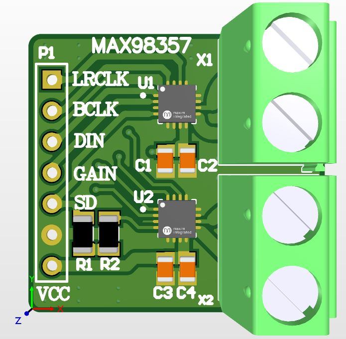

## Altium-PCBs

In this repository, I will place some of my PCBs that I have designed.
Currently, the following components exist in the repository:

- MAX98357-I2S-Module
- STM32F030K6T6-CH340 header board

MAX98357-I2S-Module

STM32F030K6T6-CH340 header board

